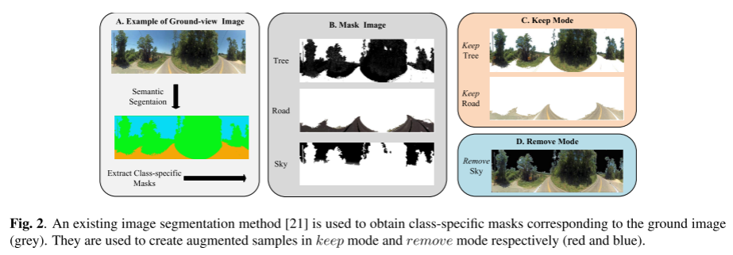
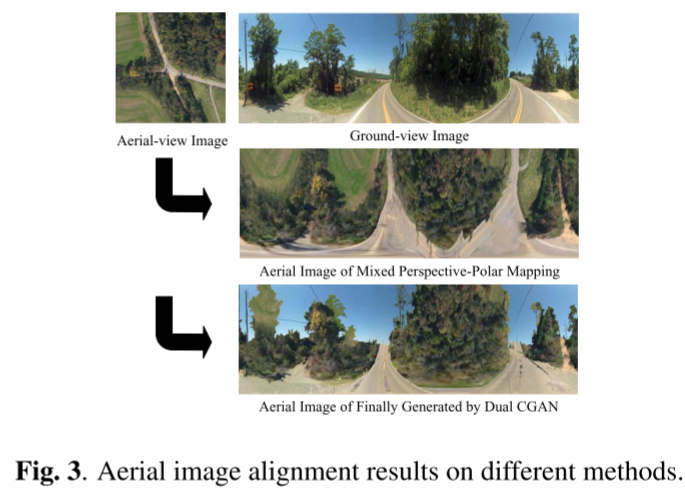
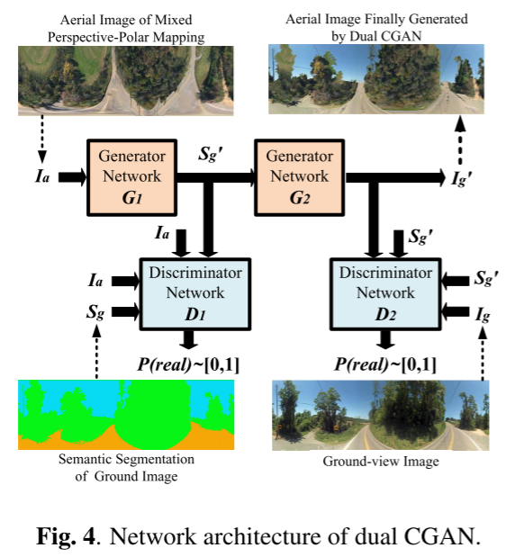
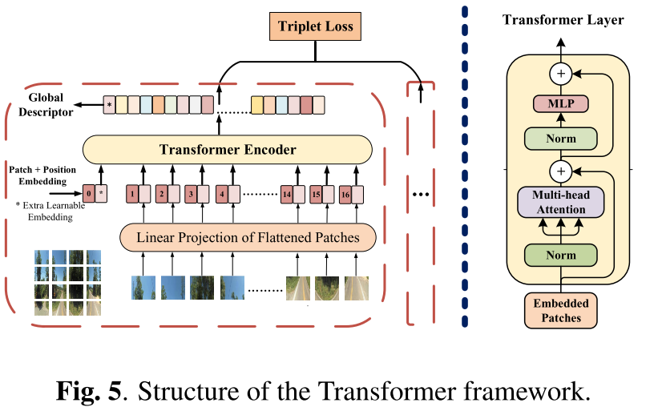
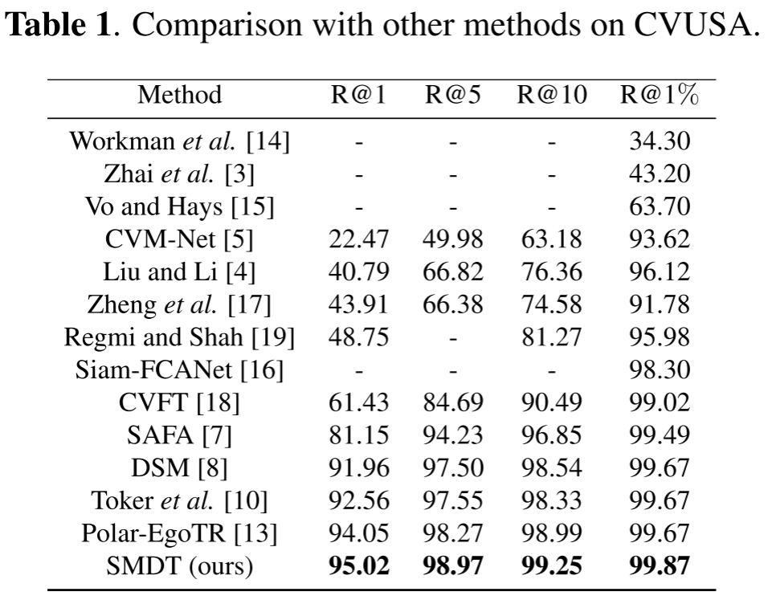
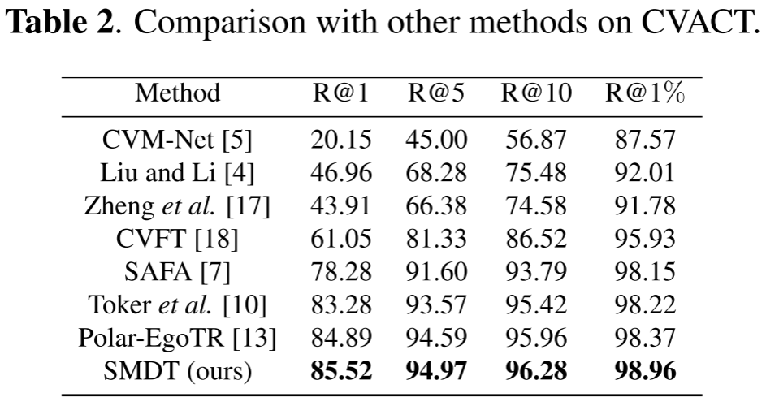

# SMDT-PyTorch
**[SMDT: Cross-View Geo-Localization with Image Alignment and Transformer.]()**  [ICME 2022]().

### Pytorch Version
The repository offers the main implementation of our paper in PyTorch.

### MindSpore Version
The MindSpore version is available at [https://github.com/TianXiaoYang-UESTC/SMDT-MindSpore](https://github.com/TianXiaoYang-UESTC/SMDT-MindSpore)

## Contents
  - [Abstract](#Abstract)
  - [Dataset](#Dataset)
  - [Image Alignment](#Image_Alignmentn)
  - [Transformer](#Transformer)
  - [Results](#Results)
  - [Acknowledgment](#Acknowledgment)

## Abstract
The goal of cross-view geo-localization is to determine the location of a given ground image by matching with aerial images. However, existing methods ignore the variability of scenes, additional information and spatial correspondence of covisibility and non convisibility areas in ground-aerial image pairs. In this context, we propose a cross-view matching method called SMDT with image alignment and Transformer. First, we utilize semantic segmentation technique to segment different areas. Then, we convert the vertical view of aerial images to front view by mixing polar mapping and perspective mapping. Next, we simultaneously train dual conditional generative adversarial nets by taking the semantic segmentation images and converted images as input to synthesize the aerial image with ground view style. These steps are collectively referred to as image alignment. Last, we use Transformer to explicitly utilize the properties of self-attention. Experiments show that our SMDT method is superior to the existing ground-to-aerial cross-view methods.

## Dataset

* CVUSA：[https://github.com/viibridges/crossnet](https://github.com/viibridges/crossnet)
* CVACT：[https://github.com/Liumouliu/OriCNN](https://github.com/Liumouliu/OriCNN)

## Image Alignment

### Semantic Segmentation

### Mixed Perspective-Polar Mapping

### Dual Conditional Generative Adversarial Nets

Please refer to the [Image_Alignment](https://github.com/TianXiaoYang-UESTC/SMDT-PyTorch/tree/main/Image_Alignment) folder for more details.

## Transformer

### Transformer for Cross-View Geo-localization

Please refer to the [Transformer](https://github.com/TianXiaoYang-UESTC/SMDT-PyTorch/tree/main/Transformer) folder for more details.

## Results

### Results on CVUSA

### Results on CVACT

## Acknowledgment
This source code of Image Alignment is inspired by [PanoGAN](https://github.com/sswuai/PanoGAN), the source code of Transformer is inspired by [Polar-EgoTR](https://github.com/yanghongji2007/cross_view_localization_L2LTR)